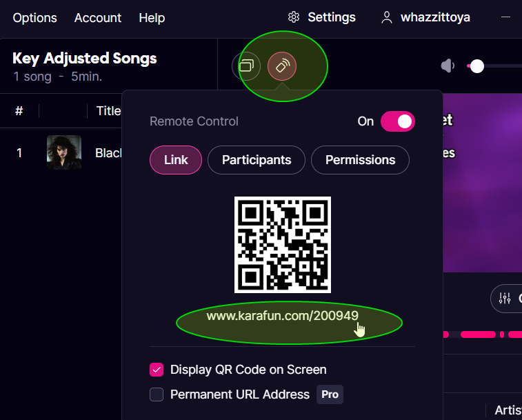

## Installation and Setup
1. In your browser, install the [Tampermonkey extension](https://www.tampermonkey.net/). Greasemonkey or other user script extensions *might* work, but it's only been tested with Tampermonkey in Firefox.
2. Install the WhazzKarafun.user.js script into it by clicking on the [raw version stored in Github](https://github.com/WhazzItToYa/Streamerbot-Karafun/raw/refs/heads/main/WhazzKarafun.user.js). The extension should come up and offer to install it. Click "(Re)Install"
3. Import the [WhazzKarafun.sb](https://raw.githubusercontent.com/WhazzItToYa/Streamerbot-Karafun/refs/heads/main/WhazzKarafun.sb) import string into Streamer.bot as normal
4. In Streamer.bot, make sure you have the websocket server enabled under Servers/Clients > Websocket Server, on port 8080[*](#Configuration)

## Usage

After opening the Karafun app, to activate the integration with Streamer.bot, press the Karafun app's remote-control button, and open the link in your browser.

The integration gets its information from the remote control page, so keep it open while you are singing. There is a status box in the lower-left indicating whether the userscript is working, and connected to streamer.bot. See [Status Icon](#Status-Icon) and [Configuration](#Configuration) for more details.

### Triggers

#### Song Update
The "Song Update" trigger will fire whenever a new song starts.

**Arguments**:
  * `song` : The name of the song.
  * `artist` : The artist of the song.
  
#### Song Stopped
This trigger will fire when the final song in the queue has finished. It has no arguments.

The import contains example actions using these triggers.

### Controls

The integration can control certain aspects of the Karafun app from Streamer.bot

#### Key and Tempo

You can use the [Execute Method](https://docs.streamer.bot/api/sub-actions/core/csharp/execute-csharp-method) subaction to run various "Karafun Integration" methods to change the Key and Tempo of the currently playing song:
* `KeyUp`/`KeyDown` : Changes the key by one half-step
* `KeyReset` : Sets the key back to the song's native key.
* `TempoUp`/`TempoDown` : Increases or decreases the tempo.
* `TempoReset` : Sets the tempo back to the native tempo.

##### Did you know?
The Karafun app can remember your key & tempo preferences for a song. Follow the [instructions here](https://www.karafun.com/help/video-tutorials_372.html).

### Status Icon

When the script is active on a page, it will display status icons. The note icon indicates that the script has located where the song info lives on the page, and will be watching it.

The Streamer.bot icon indicates that the script is connected to Streamer.bot's websocket server.

If there's a "no go" indicator across Streamer.bot, it is not connected.

If the "no go" is on the note icon, it means that the script is unable to find the song information in the page.  If you believe that you are on a valid remote control page, then Karafun might have changed their website, and the script will need an update. If the status indicator doesn't show up at all, the script may also need an update. See below for contact information. 

### Configuration
By default, the script will communicate with the streamer.bot websocket server on port 8080.  If you need to change this, click on the Streamer.bot icon in the status box, and enter the new host & port of the Streamer.bot websocket server.

## Notes
If the Karafun remote site disconnects from the Karafun app, or loses its connection to Streamer.bot, then the triggers won't occur until the site reconnects.

The technique of scraping the artist & song data off of the site using a userscript is inherently fragile, and changes to the site could break it.  I probably won't notice right away, so feel free to bug me via the streamer.bot Discord to get it fixed.

## Contact

* For feature requests or bug reports: https://github.com/WhazzItToYa/Streamerbot-Karafun/issues 
* Or submit a pull request
* Or if you can't do either of those things, ping me through the Streamer.bot Discord in the [Karafun Song Info post](https://discord.com/channels/834650675224248362/1346360720773615718)

